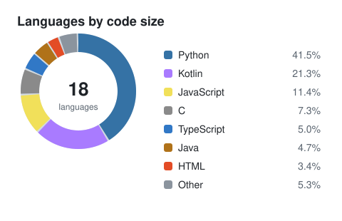
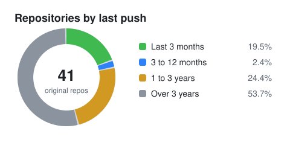

<h1 align="center">Hi, I'm Nickson Kaigi 👋</h1>

  Full-stack Python engineer in Nairobi, Kenya. 
  I build fast APIs, tune databases and keep deployments boring.

  
  
  

## About me

- 🐍 Over a decade of building SaaS backends with **Python**, **Django** and **FastAPI**
- 🗄️ I like database work: partitioning, query tuning and API performance
- ☁️ Cloud and delivery: AWS, Docker, Jenkins and GitHub Actions
- 🌍 I work remotely with teams in the UK, US and New Zealand
- 🤝 Open to collaborating on Python, Django and Neovim projects, and to contributing to open source
- 🧠 Interested in machine learning

## Tech stack

## My GitHub at a glance

  
  

Charts cover my original (non-fork) public repositories and refresh automatically every week.

## Featured projects

| Project | What it is | |
| --- | --- | --- |
| [**configs**](https://github.com/nickaigi/configs) | My Linux and Neovim configuration files (Lua) |  |
| [**django-pesapal**](https://github.com/nickaigi/django-pesapal) | Demo of integrating PesaPal payments into a Django app |  |
| [**happening_backend**](https://github.com/nickaigi/happening_backend) | Backend for a news app: "It's happening" |  |
| [**kotlin-coursera**](https://github.com/nickaigi/kotlin-coursera) | Code from the Coursera *Kotlin for Java Developers* course |  |
| [**effective-javascript**](https://github.com/nickaigi/effective-javascript) | Notes from *Effective JavaScript* by David Herman |  |

## Get in touch

Have a slow query or a big migration? Email me at [nickaigi@gmail.com](mailto:nickaigi@gmail.com) or find me on [LinkedIn](https://linkedin.com/in/nickson-kaigi). More about my work is on my [portfolio](https://nickaigi.github.io).
